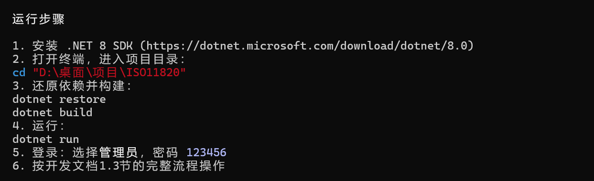
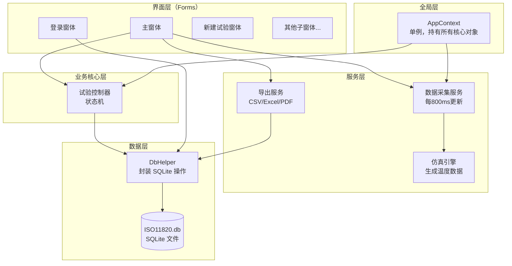

# ISO 11820 建筑材料不燃性试验仿真系统 — 开发文档

> **目标读者**：准备从零用 AI 工具开发本系统的学生。  
> **文档目的**：说清楚这个软件是什么、要实现哪些功能、用哪些技术、数据怎么组织。  
> **开发方式**：不需要参考任何现成代码，完全用 AI 编程工具自行实现。

---

## 一、这个软件是什么

### 1.1 背景

在建材防火实验室中，需要把建筑材料样品放入加热炉，加热到 **750°C**，记录 **60 分钟**的温度数据，判断材料是否"不燃"。

**但我们没有真实硬件。** 所以这个软件的任务是：

> 用程序仿真出整个试验流程——温度数据由软件自动生成，用户按照真实操作流程走一遍，最终生成标准格式报告。

### 1.2 软件定位

| 项目 | 说明 |
|------|------|
| 类型 | Windows 桌面应用（WinForms） |
| 开发语言 | C# / .NET 8 |
| 数据库 | SQLite（本地文件，无需安装服务） |
| 运行要求 | Windows 10/11，无需联网，无需硬件 |

### 1.3 完整演示流程

这是软件做好后需要能跑通的完整流程：

```
1. 启动程序 → 显示登录界面

2. 选择“管理员”，输入密码 123456 → 进入主界面

3. 点击"新建试验" → 填写样品名称、质量等信息 → 保存

4. 点击"开始升温"
   → 炉温从室温开始上升（仿真，每 800ms 更新一次，升温速度由配置决定）
   → 状态变为：升温中（Preparing）
   → 曲线图实时更新

5. 等待温度升到 747°C 以上且连续稳定
   → 状态自动变为：就绪（Ready）
   → 系统提示"温度已稳定，可以开始记录"

6. 点击"开始记录"
   → 状态变为：记录中（Recording）
   → 计时器开始计数（显示秒数）
   → 每秒记录一行温度数据

7. 等待（标准 60 分钟、固定时长到达，或手动停止）
   → 状态变为：完成（Complete）
   → 点击“试验记录”保存现象和试验后质量
   → 保存成功后生成 CSV / Excel / PDF 文件，并标记本次试验已完成

8. 切换到"记录查询"Tab
   → 能看到刚完成的试验记录

9. 点击导出 → Excel/PDF 文件正确生成
```

---

## 二、必须实现的功能

### 2.1 登录

| 功能 | 说明 |
|------|------|
| 角色选择 | 单选按鈕选择角色：**管理员** 或 **试验员** |
| 密码登录 | 输入对应角色的访问口令（密码）|
| 初始账号 | 管理员：admin / 123456；试验员：experimenter / 123456 |
| 登录失败提示 | 显示「密码错误，请重新输入」 |

> **注意**：登录页面**没有用户名输入框**，用户名是根据角色确定的（管理员 = `admin`，试验员 = `experimenter`）。当前代码按 `operators.username + operators.pwd` 校验登录，不按 `operators.userid` 校验。

### 2.2 新建试验

| 功能 | 说明 |
|------|------|
| 填写环境信息 | 环境温度、环境湿度 |
| 填写样品信息 | 样品编号（productid）、试验标识（testid）、样品名称、规格、高度（mm）、直径（mm）|
| 填写试验参数 | 操作员名、试验时长模式（标准 60 分钟 / 自定义分钟）|
| 填写初始质量 | 试验前样品质量（克），用于计算失重率 |
| 设备信息自动带入 | 设备编号、设备名称、检定日期、恒功率值（从全局配置自动填入）|
| 一键创建 | 点击“创建试验”保存到数据库，等待试验开始 |

### 2.3 仿真温度

系统有 **5 个温度通道**，全部由仿真引擎自动生成：

| 通道 | 名称 | 行为 |
|------|------|------|
| 炉温1（TF1） | 加热炉内温度（主） | 升温 → 稳定在 750°C |
| 炉温2（TF2） | 加热炉内温度（副） | 升温阶段与 TF1 同步但各有独立随机噪声；稳定阶段均钳位到 750°C |
| 表面温（TS） | 样品表面温度 | 记录阶段向炉温 × 0.95 指数接近，非记录阶段约为炉温 × 0.3 |
| 中心温（TC） | 样品中心温度 | 记录阶段向炉温 × 0.85 指数接近（比表面温更慢），非记录阶段约为炉温 × 0.25 |
| 校准温（TCal）| 标定用温度 | = TF1 + 随机波动 × 2，仅数值显示，不在曲线图中体现 |

**仿真三个阶段的具体算法**（每 800ms 执行一次）：

```
升温阶段（TF1 < TargetTemp - StableThreshold，即 < 747°C）：
  TF1 += HeatingRatePerSecond × 0.8 + 随机噪声   // 若配置为 5°C/s，每次约 +4°C；当前 appsettings 为 40°C/s，每次约 +32°C
  TF2 += HeatingRatePerSecond × 0.8 + 随机噪声   // 与 TF1 独立噪声
  TS  = TF1 × 0.3 + 随机噪声                     // 非记录阶段低值跟随
  TC  = TF1 × 0.25 + 随机噪声
  TCal = TF1 + 随机噪声 × 2

稳定阶段（TF1 >= 747°C）：
  TF1 = 750 + 随机噪声                            // 直接钳位到目标温度
  TF2 = 750 + 随机噪声
  稳定计数器 ++，当计数器 > 3 时 IsStable = true（每 800ms 一次，约 3.2 秒）
  CheckStartCriteria 同时满足「745~755°C」且「IsStable」→ 切换到 ReadyCheckStartCriteria 同时满足「745~755°C」且「IsStable」→ 切换到 Ready

记录阶段（Recording）：
  surfaceTarget = min(TF1 × 0.95, 800)
  TS += (surfaceTarget - TS) × 0.02 + 随机噪声   // 指数接近，慢速上升

  centerTarget = min(TF1 × 0.85, 750)
  TC += (centerTarget - TC) × 0.01 + 随机噪声    // 比表面温更慢

降温阶段（停止升温后）：
  TF1 -= 0.5 + 随机噪声 × 0.1                    // 缓慢冷却
  TF2 -= 0.5 + 随机噪声 × 0.1

随机噪声 = Random(-1, 1) × TempFluctuation       // TempFluctuation 默认 0.5°C随机噪声 = Random(-1, 1) × TempFluctuation       // TempFluctuation 默认 0.5°C
```

### 2.4 试验状态机

系统有 **5 个状态**，按顺序流转：

```
Idle（空闲）
  ↓ 用户点击「开始升温」
Preparing（升温中）
  ↓ 温度达到 745~755°C 且稳定计数器 >3 次 tick（约 3.2 秒，自动判定）
Ready（就绪）
  ↓ 用户点击「开始记录」
Recording（记录中）
  ↓ 固定时长到达 / 标准模式到 3600 秒 / 标准检查点满足终止条件 / 用户点击「停止记录」
Complete（完成）
  ↓ UI 提示保存试验记录；保存成功后 Flag = "10000000"，清空当前试验缓存
Preparing（等待下次试验）
```

> 💡 **当前代码口径**：控制器内部仍会在 `Complete` 后回到 `Preparing` 保持炉温，但 UI 会根据 `testmaster.Totaltesttime > 0` 且 `Flag != "10000000"` 判断存在“已完成但未保存”的试验。此时禁止开始记录和新建试验，只提示用户保存试验记录，避免覆盖未落库的结果。

> 💡 **Complete → Preparing 的原因**：炉子已经加热到 750°C，不需要冷却再重新升温。试验完成并保存后，系统保持恒温状态，用户新建下一次试验后可以直接等待 Ready，节省升温等待时间。如果用户点击「停止加热」，则从 Preparing 或 Ready 回到 **Idle**（炉子停止加热，温度开始下降）。

> ⚠️ 特殊规则：Ready 状态下若温度跌出稳定范围，自动回退到 Preparing。

### 2.5 实时数据显示

主界面需要实时显示（每秒刷新）：

| 显示项 | 要求 |
|--------|------|
| 5 通道温度数值 | LED 大字体风格，单位 °C，保留 1 位小数 |
| 计时器 | 显示已记录秒数（整数），仅在 Recording 状态下计时 |
| 温度漂移 | 显示最近 10 分钟炉温的变化趋势（°C/10min）|
| 当前状态 | 中文文字描述（升温中 / 就绪 / 记录中 等）|
| 样品编号 | 当前试验的样品编号 |
| 系统消息 | 时间戳 + 消息内容，不同事件显示不同颜色 |

**温度曲线图**（使用 OxyPlot 组件）：
- 共 **4 条折线**：炉温1、炉温2、表面温、中心温（颜色各异）
- 校准温**不画曲线**，只在数值面板单独显示
- X 轴为时间（秒），滚动显示最近 10 分钟
- Y 轴为温度（°C），范围 0~800

### 2.6 系统消息日志

主界面需要有一个**系统消息区域**（如 RichTextBox 或 ListView），实时显示系统产生的关键事件消息，参考截图中的样式。

**消息的数据结构：**

```csharp
class MasterMessage
{
    string Time;     // 消息时间，格式 HH:mm:ss，如 "18:28:14"
    string Message;  // 消息内容，如 "系统初始化，操作员：admin"
}
```

**消息来源 — 什么时候产生消息：**

| 触发时机 | 消息内容示例 | 颜色建议 |
|---------|------------|---------|
| 程序启动/初始化完成 | `系统初始化，操作员：admin` | 白色（普通）|
| 状态切换 Idle→Preparing | `开始升温，系统升温中` | 白色（普通）|
| 状态切换 Preparing→Ready | `温度已稳定，可以开始记录` | 白色（普通）|
| 状态切换 Ready→Recording | `开始记录，计时开始` | 白色（普通）|
| 试验提前满足终止条件 | `满足终止条件，试验结束` | 黄色（提示）|
| 试验到达 60 分钟 | `记录时间到达 3600 秒，试验自动结束` | 白色（普通）|
| 用户手动停止记录 | `用户手动停止记录` | 白色（普通）|

**消息的流转机制（关键！）：**

```
后台线程（每1秒）
  → TestMaster.DoWork()
  → 发现需要记录消息 → messages.Add(new MasterMessage{...})
  → 触发 DataBroadcast 事件，Messages 携带消息列表

主界面（UI 线程）
  → 订阅 DataBroadcast 事件
  → 事件触发在后台线程，必须用 Invoke 切回 UI 线程
  → 遍历 e.Messages，逐条追加到消息列表控件
  → 自动滚动到最新一条
```

**代码示意（MainForm 里的事件处理）：**

```csharp
// 订阅事件
_testMaster.DataBroadcast += OnDataBroadcast;

// 事件回调（在后台线程触发，必须 Invoke）
private void OnDataBroadcast(object sender, DataBroadcastEventArgs e)
{
    this.Invoke(() =>
    {
        // 更新温度显示、曲线、状态标签...
        foreach (var msg in e.Messages)
        {
            var color = msg.Message.Contains("终止") ? Color.Yellow : Color.White;
            richTextBoxLog.SelectionColor = color;
            richTextBoxLog.AppendText($"{msg.Time}  {msg.Message}\n");
            richTextBoxLog.ScrollToCaret();
        }
    });
}
```

> ⚠️ **必须注意**：`DataBroadcast` 事件在**后台线程**触发，直接在回调里操作 UI 控件会崩溃（跨线程异常）。必须用 `this.Invoke(() => { ... })` 切回 UI 线程再操作。

### 2.7 按钮状态控制

按钮的可用状态必须严格跟随状态机：

| 按钮 | Idle | Preparing | Ready | Recording | Complete |
|------|:----:|:---------:|:-----:|:---------:|:--------:|
| 新建试验 | ✅ | 有活动试验时❌；无活动试验或上次已保存✅ | ❌ | ❌ | 未保存❌；保存后✅ |
| 开始升温 | ✅ | ❌ | ❌ | ❌ | ❌ |
| 停止升温 | ❌ | ✅ | ✅ | ❌ | ✅ |
| 开始记录 | ❌ | ❌ | ✅ | ❌ | ❌ |
| 停止记录 | ❌ | ❌ | ❌ | ✅ | ❌ |
| 参数设置 | ✅ | ✅ | ✅ | ❌ | ✅ |

> **关键保护规则**：如果当前试验已有 `totaltesttime > 0` 且 `flag != "10000000"`，表示“已完成但尚未保存试验记录”。此时即使控制器状态回到 Preparing，也不能新建试验或重新开始记录，必须先保存现象记录和试验后质量。

### 2.8 试验现象记录

试验完成后，用户点击“试验记录”打开窗口填写：

| 字段 | 类型 | 说明 |
|------|------|------|
| 是否出现持续火焰 | 复选框 | 勾选后可输入火焰发生时刻和持续时间 |
| 火焰发生时刻 | 数字输入 | 单位：秒（勾选火焰后才可用）|
| 火焰持续时间 | 数字输入 | 单位：秒（勾选火焰后才可用）|
| 试验后质量 | 数字输入 | 单位：克，**必填**，用于计算失重率 |
| 备注 | 文本框 | 可选 |

保存后自动计算：
- **失重量** = 试验前质量 - 试验后质量
- **失重率** = 失重量 / 试验前质量 × 100%
- **炉温1温升** = 最终炉温1 - 环境温度
- **炉温2温升** = 最终炉温2 - 环境温度
- **表面温升** = 最终表面温 - 环境温度
- **中心温升** = 最终中心温 - 环境温度
- **综合温升 deltatf**：当前代码取表面温升 `deltats`，报告中按“样品温升”展示

### 2.9 数据导出

试验完成后，支持以下三种格式导出：

| 格式 | 内容 | 触发方式 |
|------|------|---------|
| CSV | 每秒一行，包含时间和5通道温度 | 试验完成自动生成 |
| Excel | Sheet1：试验信息表；Sheet2：温度数据；Sheet3：温度曲线图 | 手动点击导出或自动生成 |
| PDF | 试验概要 + 温度曲线图片 + 判定结论 | 保存试验记录后自动生成，或手动触发 |

**文件存储路径**（自动按层级创建目录，基础目录由 `appsettings.json` 配置）：
```
{BaseDirectory}\
├── TestData\{ProductId}\{TestId}\sensor_data.csv
└── Reports\{TestId}_报告.xlsx
```

### 2.10 历史记录查询

主界面的"记录查询" Tab 提供：

| 功能 | 说明 |
|------|------|
| 按日期范围查询 | 选择开始和结束日期 |
| 按样品编号查询 | 模糊匹配 |
| 按操作员查询 | 下拉选择 |
| 查看详情 | 双击列表行弹出试验完整信息 |
| 导出查询结果 | 导出为 Excel 文件 |

### 2.11 设备校准（传感器标定）

"设备校准" Tab 中：

| 功能 | 说明 |
|------|------|
| 实时显示校准温 | 显示第5通道（校准温度通道）当前数值 |
| 记录校准数据 | 在标准温度下记录多个温度点 |
| 保存校准记录 | 存入数据库，包含日期、操作员、记录数据 |
| 查看历史校准 | 列出所有历史校准记录 |

---

## 三、不需要实现的功能

| 功能 | 原因 |
|------|------|
| 真实串口 / Modbus 通信 | 无硬件，用仿真引擎替代 |
| 真实 PID 控制算法 | 仿真模式下不需要 |
| 摄像头火焰检测 | 需要摄像头硬件，Demo 中跳过 |
| 多炉同时控制 | 只做单炉 |
| ISO 标准完整合规判定 | 简化处理，只计算温升和失重率 |
| 网络 / 云端同步 | 纯本地运行 |
| 复杂权限管理 | 简单角色区分（管理员/实验员）即可 |

---

## 四、技术栈

### 4.1 开发环境

| 项目 | 要求 |
|------|------|
| 操作系统 | Windows 10 / 11 |
| 开发框架 | .NET 8 |
| UI 框架 | Windows Forms（WinForms） |
| IDE | Visual Studio 2022（推荐）|

### 4.2 必须用到的第三方库

| 库名 | 版本 | 用途 |
|------|------|------|
| **OxyPlot.WindowsForms** | 2.x | 实时温度折线图 |
| **EPPlus** | 7.x | 生成带图表的 Excel 报告 |
| **PDFsharp-MigraDoc** | 6.x | 生成 PDF 报告 |
| **Microsoft.Data.Sqlite** | 8.x | 直接操作 SQLite 数据库（写 SQL，不用 ORM）|
| **Microsoft.Extensions.Configuration** | 8.x | 读取 appsettings.json 配置 |
| **Serilog + Serilog.Sinks.File** | 4.x | 结构化日志，写入滚动文件 |
| **MathNet.Numerics** | 5.x | 温漂线性回归计算 |

> **💡 说明**：直接使用 `Microsoft.Data.Sqlite` 而不用 EF Core ORM，好处是学习成本低、SQL 透明可调试、出错信息直接。安装命令：`dotnet add package Microsoft.Data.Sqlite`

> **不需要引入的库**：`FluentModbus`（串口 Modbus）、`Emgu.CV`（摄像头）——仿真模式下无需真实硬件通信。

---

## 五、推荐的代码分层结构

这是一种清晰的分层方式，学生可以自行决定具体文件名：



**关键设计原则**：
- 上层依赖下层，下层**不能**知道上层
- 数据从下层传到上层通过**事件（event）**，不能直接调用 UI 方法
- 所有 UI 更新必须在 UI 线程执行（跨线程用 `Invoke`）

---

## 六、数据组织

### 6.1 数据库（SQLite，共 6 张表）

```
operators     ← 操作员（用户名、密码、角色）
productmaster ← 样品信息（名称、规格、尺寸）
apparatus     ← 设备信息（设备编号、串口配置）
sensors       ← 传感器配置（量程、通道ID）
testmaster    ← 试验记录（核心表，每次试验一条）
CalibrationRecords ← 校准历史记录
```

**试验主表（testmaster）关键字段**：

| 字段 | 含义 |
|------|------|
| productid + testid | 联合主键 |
| testdate | 试验日期 |
| operator | 操作员 |
| preweight / postweight | 试验前后质量（g）|
| lostweight_per | **失重率（%）——判定项** |
| deltatf | **温升（°C）——判定项** |
| totaltesttime | 总试验时长（秒）|

### 6.2 温度时序文件（CSV）

每次试验独立一个 CSV 文件，存放在：
```
D:\ISO11820\TestData\{样品ID}\{试验ID}\sensor_data.csv
```

文件格式（每秒一行）：
```csv
Time,Temp1,Temp2,TempSurface,TempCenter,TempCalibration
0,25.0,24.9,24.5,24.3,25.1
1,30.1,30.0,24.6,24.4,25.0
...
```

### 6.3 配置文件（appsettings.json）

学生最需要关注的配置项：

```json
{
  "Database": {
    "Provider": "Sqlite",
    "SqlitePath": "Data\\ISO11820.db"
  },
  "Hardware": {
    "ConstPower": 2048,
    "PidTemperature": 750,
    "SensorProtocol": "ModbusRtu"
  },
  "Simulation": {
    "EnableSimulation": true,
    "SimulateSensors": true,
    "SimulatePidController": true,
    "InitialFurnaceTemp": 720.0,
    "TargetFurnaceTemp": 750.0,
    "HeatingRatePerSecond": 40.0,
    "TempFluctuation": 0.5,
    "StableThreshold": 3.0,
    "SimulateFlame": false
  },
  "FileStorage": {
    "BaseDirectory": "D:\\ISO11820",
    "TestDataDirectory": "D:\\ISO11820\\TestData"
  },
  "Report": {
    "OutputDirectory": "D:\\ISO11820\\Reports",
    "EnablePdfExport": true
  }
}
```

> **关键**：`EnableSimulation: true` 表示仿真模式，开发阶段必须设为 true。当前仓库的演示配置从 720°C 起步，升温速度较快，是为了课堂/演示时尽快进入 Ready。

---

## 七、关键技术设计说明

### 7.1 数据采集与仿真的切换

`DaqWorker`（数据采集服务）每 **800ms** 运行一次：

```
读取配置：EnableSimulation?

  仿真模式 → 调用 SensorSimulator.Update()
              → 返回仿真温度数据
              → 更新到传感器字典

  硬件模式 → 通过串口 Modbus 读取真实传感器
              → 更新到传感器字典
```

### 7.2 恒功率值计算

进入 Ready 状态后，系统持续记录 PID 输出值到队列（最多 600 个）。用户点击"开始记录"时：

```
恒功率 = 队列中所有PID输出值的平均值
切换到恒功率模式（仿真时只改变仿真器的行为）
```

### 7.3 温漂计算

判断炉温是否"稳定"：对最近 10 分钟（600 个数据点）的炉温序列做**线性回归**，斜率即为温漂（°C/10min）。  
斜率绝对值 < 阈值（约 2°C/10min）→ 认为温度已稳定。

使用 `MathNet.Numerics` 的 `SimpleRegression.Slope()` 实现。

### 7.4 试验终止条件

```
标准 60 分钟模式：
  每 5 分钟检查一次终止条件（在第 30、35、40、45、50、55 分钟）
  或到达第 60 分钟无条件终止

可提前终止的条件（根据 ISO 标准简化版）：
  当前代码复用炉温稳定条件：10分钟温漂有效，且炉温1/炉温2的10分钟温漂均不超过 MaxTemperatureDriftPerTenMinutes

手动终止：
  用户点击"停止记录"按钮；若已有有效记录样本，则进入 Complete，否则回到 Preparing

固定时长模式：
  忽略提前终止检查，到达 TargetDurationSeconds 后完成试验

判定结论：
  报告汇总中当前按 deltatf <= 50、lostweight_per <= 50、flameduration < 5 判断”通过/不通过”
```

---

## 八、PPT 演示资料（项目总结）

> 以下内容可直接用于制作项目答辩/展示 PPT，每个小节对应一张或一组幻灯片。

### 8.1 项目一句话概述

> **”ISO 11820 建筑材料不燃性试验仿真系统”** —— 在没有真实硬件的条件下，用软件完整仿真建材防火试验的全流程，包括温度模拟、数据采集、报告生成。

### 8.2 项目背景与痛点

| 痛点 | 说明 |
|------|------|
| 硬件昂贵 | 一套真实不燃性试验炉造价数十万，教学场景无法配备 |
| 操作危险 | 750°C 高温炉，学生操作风险大 |
| 周期长 | 单次试验需 60 分钟，课堂时间有限 |
| 教学困难 | 无法让每个学生都动手操作真实设备 |

**本软件解决方案**：纯软件仿真 → 零成本、零风险、可加速、可重复。

### 8.3 技术架构（一张图讲清楚）

```
┌─────────────────────────────────────────────────────┐
│                    UI 层 (WinForms)                   │
│  ┌──────────┐ ┌──────────┐ ┌──────────┐             │
│  │ 登录窗体  │ │ 主窗体    │ │ 子窗体   │             │
│  │LoginForm │ │MainForm  │ │(新建/记录)│             │
│  └──────────┘ └──────────┘ └──────────┘             │
├─────────────────────────────────────────────────────┤
│                  Core 核心层                          │
│  ┌──────────────────────────────────┐                │
│  │       TestMaster 状态机           │                │
│  │  Idle → Preparing → Ready        │                │││无所事事→ Preparing →准备│                 ││  │  Idle → Preparing → Ready        │                │││无所事事→ Preparing →准备│                 ││  │  Idle → Preparing → Ready        │                │││无所事事→ Preparing →准备│                 ││  │  Idle → Preparing → Ready        │                │││无所事事→ Preparing →准备│                 ││  │  Idle → Preparing → Ready        │                │││无所事事→ Preparing →准备│                 ││  │  Idle → Preparing → Ready        │                │││无所事事→ Preparing →准备│                 ││  │  Idle → Preparing → Ready        │                │││无所事事→ Preparing →准备│                 ││  │  Idle → Preparing → Ready        │                │││无所事事→ Preparing →准备│                 ││  │  Idle → Preparing → Ready        │                │││无所事事→ Preparing →准备│                 ││  │  Idle → Preparing → Ready        │                │││无所事事→ Preparing →准备│                 ││  │  Idle → Preparing → Ready        │                │││无所事事→ Preparing →准备│                 ││  │  Idle → Preparing → Ready        │                │││无所事事→ Preparing →准备│                 ││  │  Idle → Preparing → Ready        │                │││无所事事→ Preparing →准备│                 ││  │  Idle → Preparing → Ready        │                │││无所事事→ Preparing →准备│                 ││  │  Idle → Preparing → Ready        │                │││无所事事→ Preparing →准备│                 ││  │  Idle → Preparing → Ready        │                │││无所事事→ Preparing →准备│                 ││  │  Idle → Preparing → Ready        │                │││无所事事→ Preparing →准备│                 ││  │  Idle → Preparing → Ready        │                │││无所事事→ Preparing →准备│                 ││  │  Idle → Preparing → Ready        │                │││无所事事→ Preparing →准备│                 ││  │  Idle → Preparing → Ready        │                │││无所事事→ Preparing →准备│                 ││  │  Idle → Preparing → Ready        │                │││无所事事→ Preparing →准备│                 ││  │  Idle → Preparing → Ready        │                │││无所事事→ Preparing →准备│                 ││  │  Idle → Preparing → Ready        │                │││无所事事→ Preparing →准备│                 ││  │  Idle → Preparing → Ready        │                │││无所事事→ Preparing →准备│                 ││  │  Idle → Preparing → Ready        │                │││无所事事→ Preparing →准备│                 ││  │  Idle → Preparing → Ready        │                │││无所事事→ Preparing →准备│                 ││  │  Idle → Preparing → Ready        │                │││无所事事→ Preparing →准备│                 ││  │  Idle → Preparing → Ready        │                │││无所事事→ Preparing →准备│                 ││  │  Idle → Preparing → Ready        │                │││无所事事→ Preparing →准备│                 ││  │  Idle → Preparing → Ready        │                │││无所事事→ Preparing →准备│                 ││  │  Idle → Preparing → Ready        │                │││无所事事→ Preparing →准备│                 ││  │  Idle → Preparing → Ready        │                │││无所事事→ Preparing →准备│                 │
│  │       → Recording → Complete     │                │││→记录完整│→                 │││→记录完整│→                 │││→记录完整│&rarr ;                 ││  │       → Recording → Complete     │                │││→记录完整│→                 │││→记录完整│→                 │││→记录完整│&rarr ;                 ││  │       → Recording → Complete     │                │││→记录完整│→                 │││→记录完整│→                 │││→记录完整│&rarr ;                 ││  │       → Recording → Complete     │                │││→记录完整│→                 │││→记录完整│→                 │││→记录完整│&rarr ;                 ││  │       → Recording → Complete     │                │││→记录完整│→                 │││→记录完整│→                 │││→记录完整│&rarr ;                 ││  │       → Recording → Complete     │                │││→记录完整│→                 │││→记录完整│→                 │││→记录完整│&rarr ;                 ││  │       → Recording → Complete     │                │││→记录完整│→                 │││→记录完整│→                 │││→记录完整│&rarr ;                 ││  │       → Recording → Complete     │                │││→记录完整│→                 │││→记录完整│→                 │││→记录完整│&rarr ;                 ││  │       → Recording → Complete     │                │││→记录完整│→                 │││→记录完整│→                 │││→记录完整│&rarr ;                 ││  │       → Recording → Complete     │                │││→记录完整│→                 │││→记录完整│→                 │││→记录完整│&rarr ;                 ││  │       → Recording → Complete     │                │││→记录完整│→                 │││→记录完整│→                 │││→记录完整│&rarr ;                 ││  │       → Recording → Complete     │                │││→记录完整│→                 │││→记录完整│→                 │││→记录完整│&rarr ;                 ││  │       → Recording → Complete     │                │││→记录完整│→                 │││→记录完整│→                 │││→记录完整│&rarr ;                 ││  │       → Recording → Complete     │                │││→记录完整│→                 │││→记录完整│→                 │││→记录完整│&rarr ;                 ││  │       → Recording → Complete     │                │││→记录完整│→                 │││→记录完整│→                 │││→记录完整│&rarr ;                 ││  │       → Recording → Complete     │                │││→记录完整│→                 │││→记录完整│→                 │││→记录完整│&rarr ;                 ││  │       → Recording → Complete     │                │││→记录完整│→                 │││→记录完整│→                 │││→记录完整│&rarr ;                 ││  │       → Recording → Complete     │                │││→记录完整│→                 │││→记录完整│→                 │││→记录完整│&rarr ;                 ││  │       → Recording → Complete     │                │││→记录完整│→                 │││→记录完整│→                 │││→记录完整│&rarr ;                 ││  │       → Recording → Complete     │                │││→记录完整│→                 │││→记录完整│→                 │││→记录完整│&rarr ;                 ││  │       → Recording → Complete     │                │││→记录完整│→                 │││→记录完整│→                 │││→记录完整│&rarr ;                 ││  │       → Recording → Complete     │                │││→记录完整│→                 │││→记录完整│→                 │││→记录完整│&rarr ;                 ││  │       → Recording → Complete     │                │││→记录完整│→                 │││→记录完整│→                 │││→记录完整│&rarr ;                 ││  │       → Recording → Complete     │                │││→记录完整│→                 │││→记录完整│→                 │││→记录完整│&rarr ;                 ││  │       → Recording → Complete     │                │││→记录完整│→                 │││→记录完整│→                 │││→记录完整│&rarr ;                 ││  │       → Recording → Complete     │                │││→记录完整│→                 │││→记录完整│→                 │││→记录完整│&rarr ;                 ││  │       → Recording → Complete     │                │││→记录完整│→                 │││→记录完整│→                 │││→记录完整│&rarr ;                 ││  │       → Recording → Complete     │                │││→记录完整│→                 │││→记录完整│→                 │││→记录完整│&rarr ;                 ││  │       → Recording → Complete     │                │││→记录完整│→                 │││→记录完整│→                 │││→记录完整│&rarr ;                 ││  │       → Recording → Complete     │                │││→记录完整│→                 │││→记录完整│→                 │││→记录完整│&rarr ;                 ││  │       → Recording → Complete     │                │││→记录完整│→                 │││→记录完整│→                 │││→记录完整│&rarr ;                 ││  │       → Recording → Complete     │                │││→记录完整│→                 │││→记录完整│→                 │││→记录完整│&rarr ;                 │
│  └──────────────────────────────────┘                │
├─────────────────────────────────────────────────────┤
│                Services 服务层                        │
│  ┌──────────┐ ┌──────────┐ ┌──────────┐             │
│  │仿真引擎   │ │数据采集   │ │导出服务   │             │
│  │Simulator │ │DaqWorker │ │Export    │             │││模拟器││DaqWorker││出口││
│  │(5通道温度)│ │(800ms定时)│ │(CSV/Excel│             │
│  │          │ │          │ │ /PDF)    │             │││           ││           ││/ . PDF)│              │││           ││           ││/ . PDF)│              │││            ││            ││/。PDF)│               │││           ││           ││/ . PDF)│              │││            ││            ││/。PDF)│               │││            ││            ││/。PDF)│               │││             ││             ││/。PDF)│                │││           ││           ││/ . PDF)│              │││            ││            ││/。PDF)│               │││            ││            ││/。PDF)│               │││             ││             ││/。PDF)│                │││            ││            ││/。PDF)│               │││             ││             ││/。PDF)│                │││             ││             ││/。PDF)│                │││              ││              ││/。PDF)│                 │││           ││           ││/ . PDF)│              │││            ││            ││/。PDF)│               │││            ││            ││/。PDF)│               │││             ││             ││/。PDF)│                │││            ││            ││/。PDF)│               │││             ││             ││/。PDF)│                │││             ││             ││/。PDF)│                │││              ││              ││/。PDF)│                 │││           ││           ││/ . PDF)│              │││            ││            ││/。PDF)│               │││            ││            ││/。PDF)│               │││             ││             ││/。PDF)│                │││            ││            ││/。PDF)│               │││             ││             ││/。PDF)│                │││             ││             ││/。PDF)│                │││              ││              ││/。PDF)│                 │││            ││            ││/。PDF)│               │││             ││             ││/。PDF)│                │││             ││             ││/。PDF)│                │││              ││              ││/。PDF)│                 │││             ││             ││/。PDF)│                │││              ││              ││/。PDF)│                 │││              ││              ││/。PDF)│                 │││               ││               ││/。PDF)│                  │││            ││            ││/。PDF)│               │││             ││             ││/。PDF)│                │││             ││             ││/。PDF)│                │││              ││              ││/。PDF)│                 │││             ││             ││/。PDF)│                │││              ││              ││/。PDF)│                 │││              ││              ││/。PDF)│                 │││               ││               ││/。PDF)│                  │││           ││           ││/ . PDF)│              │││            ││            ││/。PDF)│               │││            ││            ││/。PDF)│               │││             ││             ││/。PDF)│                │││            ││            ││/。PDF)│               │││             ││             ││/。PDF)│                │││             ││             ││/。PDF)│                │││              ││              ││/。PDF)│                 │││            ││            ││/。PDF)│               │││             ││             ││/。PDF)│                │││             ││             ││/。PDF)│                │││              ││              ││/。PDF)│                 │││             ││             ││/。PDF)│                │││              ││              ││/。PDF)│                 │││              ││              ││/。PDF)│                 │││               ││               ││/。PDF)│                  │││            ││            ││/。PDF)│               │││             ││             ││/。PDF)│                │││             ││             ││/。PDF)│                │││              ││              ││/。PDF)│                 │││             ││             ││/。PDF)│                │││              ││              ││/。PDF)│                 │││              ││              ││/。PDF)│                 │││               ││               ││/。PDF)│                  │││            ││            ││/。PDF)│               │││             ││             ││/。PDF)│                │││             ││             ││/。PDF)│                │││              ││              ││/。PDF)│                 │││             ││             ││/。PDF)│                │││              ││              ││/。PDF)│                 │││              ││              ││/。PDF)│                 │││               ││               ││/。PDF)│                  │││             ││             ││/。PDF)│                │││              ││              ││/。PDF)│                 │││              ││              ││/。PDF)│                 │││               ││               ││/。PDF)│                  │││              ││              ││/。PDF)│                 │││               ││               ││/。PDF)│                  │││               ││               ││/。PDF)│                  │││                ││                ││/。PDF)│                   │││             ││             ││/。PDF)│                │││              ││              ││/。PDF)│                 │││              ││              ││/。PDF)│                 │││               ││               ││/。PDF)│                  │││              ││              ││/。PDF)│                 │││               ││               ││/。PDF)│                  │││               ││               ││/。PDF)│                  │││                ││                ││/。PDF)│                   │
│  └──────────┘ └──────────┘ └──────────┘             │
├─────────────────────────────────────────────────────┤
│                 Data 数据层                           │
│  ┌──────────────────────────────────┐                │
│  │     DbHelper (SQLite 直接SQL)     │                │││DbHelper (SQLite直接│SQL)                 │
│  │  6张表 + CSV温度时序文件          │                │
│  └──────────────────────────────────┘                │
└─────────────────────────────────────────────────────┘
```

### 8.4 核心功能清单

| 编号 | 功能 | 技术要点 |
|:----:|------|------|
| ① | **角色登录** | 管理员/试验员双角色，明文密码验证 |
| ② | **新建试验** | 样品信息录入 + 设备信息自动带入 |
| ③ | **仿真升温** | 5通道温度独立仿真，800ms刷新，三种阶段算法 |
| ④ | **状态机控制** | 5状态自动流转，严格按钮状态管理 |
| ⑤ | **实时曲线** | OxyPlot 4条折线，滚动显示最近10分钟 |
| ⑥ | **温度判定** | 745~755°C 稳定判定，MathNet 线性回归计算温漂 |
| ⑦ | **试验记录** | 火焰现象 + 质量变化 + 自动计算失重率/温升 |
| ⑧ | **报告导出** | CSV(自动) + Excel(带图表) + PDF(含判定结论) |
| ⑨ | **历史查询** | 日期/样品/操作员三维筛选，双击查看详情 |
| ⑩ | **设备校准** | 校准温度实时显示 + 历史记录管理 |

### 8.5 状态机流转图

```
                ┌──────────┐
                │   Idle   │ 空闲
                │  (空闲)   │
                └────┬─────┘
                     │ 用户点击「开始升温」
                     ▼
                ┌──────────┐
                │Preparing │ 升温中
                │ (升温中)  │
                └────┬─────┘
                     │ 温度达到745~755°C 且稳定>3.2秒（自动）
                     ▼
                ┌──────────┐
                │  Ready   │ 就绪
                │ (就绪)    │◄──── 温度跌出范围自动回退
                └────┬─────┘
                     │ 用户点击「开始记录」
                     ▼
                ┌──────────┐
                │Recording │ 记录中
                │ (记录中)  │
                └────┬─────┘
                     │ 到达60分钟 / 满足终止条件 / 手动停止
                     ▼
                ┌──────────┐
                │ Complete │ 完成
                │ (完成)    │
                └────┬─────┘
                     │ 保存试验记录 → flag='10000000'
                     ▼
                ┌──────────┐
                │Preparing │ 保持炉温，等待下次试验
                └──────────┘
```

### 8.6 仿真引擎核心算法

```
┌──────────────────────────────────────────────────┐
│              仿真温度生成（每800ms）                │
├──────────────────────────────────────────────────┤
│  升温阶段（TF1 < 747°C）：                         │
│    TF1 += 40°C/s × 0.8s + 随机噪声(±0.5°C)       ││    TF1  = 40°C/s × 0.8s   随机噪声(±0.5°C)       ││    TF1  = 40°C/s × 0.8s   随机噪声(±0.5°C)       ││    TF1  = 40°C/s × 0.8s   随机噪声(±0.5°C)       ││    TF1  = 40°C/s × 0.8s   随机噪声(±0.5°C)       ││    TF1  = 40°C/s × 0.8s   随机噪声(±0.5°C)       ││    TF1  = 40°C/s × 0.8s   随机噪声(±0.5°C)       ││    TF1  = 40°C/s × 0.8s   随机噪声(±0.5°C)       ││    TF1  = 40°C/s × 0.8s   随机噪声(±0.5°C)       ││    TF1  = 40°C/s × 0.8s   随机噪声(±0.5°C)       ││    TF1  = 40°C/s × 0.8s   随机噪声(±0.5°C)       ││    TF1  = 40°C/s × 0.8s   随机噪声(±0.5°C)       ││    TF1  = 40°C/s × 0.8s   随机噪声(±0.5°C)       ││    TF1  = 40°C/s × 0.8s   随机噪声(±0.5°C)       ││    TF1  = 40°C/s × 0.8s   随机噪声(±0.5°C)       ││    TF1  = 40°C/s × 0.8s   随机噪声(±0.5°C)       ││    TF1  = 40°C/s × 0.8s   随机噪声(±0.5°C)       ││    TF1  = 40°C/s × 0.8s   随机噪声(±0.5°C)       ││    TF1  = 40°C/s × 0.8s   随机噪声(±0.5°C)       ││    TF1  = 40°C/s × 0.8s   随机噪声(±0.5°C)       ││    TF1  = 40°C/s × 0.8s   随机噪声(±0.5°C)       ││    TF1  = 40°C/s × 0.8s   随机噪声(±0.5°C)       ││    TF1  = 40°C/s × 0.8s   随机噪声(±0.5°C)       ││    TF1  = 40°C/s × 0.8s   随机噪声(±0.5°C)       ││    TF1  = 40°C/s × 0.8s   随机噪声(±0.5°C)       ││    TF1  = 40°C/s × 0.8s   随机噪声(±0.5°C)       ││    TF1  = 40°C/s × 0.8s   随机噪声(±0.5°C)       ││    TF1  = 40°C/s × 0.8s   随机噪声(±0.5°C)       ││    TF1  = 40°C/s × 0.8s   随机噪声(±0.5°C)       ││    TF1  = 40°C/s × 0.8s   随机噪声(±0.5°C)       ││    TF1  = 40°C/s × 0.8s   随机噪声(±0.5°C)       ││    TF1  = 40°C/s × 0.8s   随机噪声(±0.5°C)       │
│    TF2 同上，独立噪声                              │
│    TS ≈ TF1 × 0.3，TC ≈ TF1 × 0.25               ││TS ≈ TF1 × 0.3,TC ≈ TF1 × 0.25││TS ≈ TF1 × 0.3,TC ≈ TF1 × 0.25││TS ≈ TF1 × 0.3,TC ≈ TF1 × 0.25TF1 0.3,TC TF1 0.25│TF1 0.3,TC TF1 0.25│TF1 0.3,TC TF1 0.25│TF1 0.3,TC TF1 0.25│TF1 0.3,TC TF1 0.25│
├──────────────────────────────────────────────────┤
│  稳定阶段（TF1 ≥ 747°C）：                         │
│    TF1 = 750°C + 随机噪声（直接钳位）              │
│    TF2 = 750°C + 随机噪声                         │
│    稳定计数器累加 → ≥3次 → 切换到Ready             │
├──────────────────────────────────────────────────┤
│  记录阶段（Recording）：                           │
│    TS → TF1 × 0.95（指数逼近，系数0.02）          │
│    TC → TF1 × 0.85（指数逼近，系数0.01）          │
│    每秒记录一行到CSV文件                           │
├──────────────────────────────────────────────────┤
│  降温阶段（停止升温后）：                           │
│    TF1 -= 0.5 + 随机噪声×0.1（缓慢冷却）          │
└──────────────────────────────────────────────────┘
```

### 8.7 数据库设计（ER概览）

```
┌──────────────┐     ┌──────────────────┐     ┌──────────────┐
│  operators   │     │   testmaster     │     │productmaster ││操作人员│testmaster│productmaster
├──────────────┤     ├──────────────────┤     ├──────────────┤
│ userid       │     │ productid (PK/FK)│────→│ productid(PK)││ userid       │     │ productid (PK/FK)│────→│ productid(PK)││ userid       │     │ productid (PK/FK)│────→│ productid(PK)││ userid       │     │ productid (PK/FK)│────→│ productid(PK)││ userid       │     │ productid (PK/FK)│────→│ productid(PK)││ userid       │     │ productid (PK/FK)│────→│ productid(PK)││ userid       │     │ productid (PK/FK)│────→│ productid(PK)││ userid       │     │ productid (PK/FK)│────→│ productid(PK)││ userid       │     │ productid (PK/FK)│────→│ productid(PK)││ userid       │     │ productid (PK/FK)│────→│ productid(PK)││ userid       │     │ productid (PK/FK)│────→│ productid(PK)││ userid       │     │ productid (PK/FK)│────→│ productid(PK)││ userid       │     │ productid (PK/FK)│────→│ productid(PK)││ userid       │     │ productid (PK/FK)│────→│ productid(PK)││ userid       │     │ productid (PK/FK)│────→│ productid(PK)││ userid       │     │ productid (PK/FK)│────→│ productid(PK)│
│ username     │     │ testid (PK)      │     │ productname  ││username││tested （PK）││productname││username││tested （PK）││username││tested （PK）││productname││username││测试（PK）││productname││username││测试（PK）││username││测试（PK）││username││测试（PK）││productname│
│ pwd          │     │ testdate         │     │ specific     ││pwd           ││testdate││具体││PWD│testdate│具体的│PWD│testdate│
│ usertype     │     │ operator ────────┼──┐  │ diameter     ││用户类型││操作人员────────────│直径│
└──────────────┘     │ preweight        │  │  │ height       │└──────────────┘│preweight│││高度│└──────────────┘│preweight│││高度│└──────────────┘│preweight│││高度│
                     │ postweight       │  │  └──────────────┘│postweight││││├────────────
┌──────────────┐     │ lostweight_per   │  │
│  apparatus   │     │ deltatf          │  │
├──────────────┤     │ totaltesttime    │  │
│ apparatusid  │     │ flametime        │  │
│ innernumber  │     │ flameduration    │  ││内部编号││火化││
│ apparatusname│     │ maxtf1/maxtf2... │  │
│ constpower   │     │ finaltf1/finaltf2│  │
└──────────────┘     │ flag             │  ││││││││││││
                     └──────────────────┘  │
┌──────────────┐                           │
│   sensors    │     ┌──────────────────┐  │
├──────────────┤     │CalibrationRecords│  │[…][…][…][…][…][…][…][…][…][…][…]├──────────────┤     │CalibrationRecords│  │[…][…][…][…][…][…][…][…][…][…][…]├──────────────┤     │CalibrationRecords│  │[…][…][…][…][…][…][…][…][…][…][…]├──────────────┤     │CalibrationRecords│  │[…][…][…][…][…][…][…][…][…][…][…]├──────────────┤     │CalibrationRecords│  │[…][…][…][…][…][…][…][…][…][…][…]├──────────────┤     │CalibrationRecords│  │[…][…][…][…][…][…][…][…][…][…][…]├──────────────┤     │CalibrationRecords│  │[…][…][…][…][…][…][…][…][…][…][…]├──────────────┤     │CalibrationRecords│  │[…][…][…][…][…][…][…][…][…][…][…]├──────────────┤     │CalibrationRecords│  │[…][…][…][…][…][…][…][…][…][…][…]├──────────────┤     │CalibrationRecords│  │[…][…][…][…][…][…][…][…][…][…][…]├──────────────┤     │CalibrationRecords│  │[…][…][…][…][…][…][…][…][…][…][…]├──────────────┤     │CalibrationRecords│  │[…][…][…][…][…][…][…][…][…][…][…]├──────────────┤     │CalibrationRecords│  │[…][…][…][…][…][…][…][…][…][…][…]├──────────────┤     │CalibrationRecords│  │[…][…][…][…][…][…][…][…][…][…][…]├──────────────┤     │CalibrationRecords│  │[…][…][…][…][…][…][…][…][…][…][…]├──────────────┤     │CalibrationRecords│  │[…][…][…][…][…][…][…][…][…][…][…]
│ sensorid     │     ├──────────────────┤  │
│ dispname     │     │ Id               │  │
│ outputvalue  │     │ CalibrationDate  │  │
│ signaltype   │     │ Operator ────────┼──┘│信号型││操作人员────────├──├──
└──────────────┘     │ TemperatureData  ││──────────│││
                     └──────────────────┘

温度时序数据不入库 → 存为 CSV 文件
  {BaseDir}\TestData\{ProductId}\{TestId}\sensor_data.csv
```

### 8.8 技术栈一览
| 分类 | 技术 | 用途 |
|------|------|------|
| 框架 | .NET 8 + WinForms | 桌面应用 || 框架 | .NET 8   WinForms | 桌面应用 || 框架 | .NET 8   WinForms | 桌面应用 || 框架 | .NET 8   WinForms | 桌面应用 || 框架 | .NET 8   WinForms | 桌面应用 || 框架 | .NET 8   WinForms | 桌面应用 || 框架 | .NET 8   WinForms | 桌面应用 || 框架 | .NET 8   WinForms | 桌面应用 || 框架 | .NET 8   WinForms | 桌面应用 || 框架 | .NET 8   WinForms | 桌面应用 || 框架 | .NET 8   WinForms | 桌面应用 || 框架 | .NET 8   WinForms | 桌面应用 || 框架 | .NET 8   WinForms | 桌面应用 || 框架 | .NET 8   WinForms | 桌面应用 || 框架 | .NET 8   WinForms | 桌面应用 || 框架 | .NET 8   WinForms | 桌面应用 |
| 数据库 | SQLite + Microsoft.Data.Sqlite | 本地数据存储 || 数据库 | SQLite   Microsoft.Data.Sqlite | 本地数据存储 || 数据库 | SQLite   Microsoft.Data.Sqlite | 本地数据存储 || 数据库 | SQLite   Microsoft.Data.Sqlite | 本地数据存储 || 数据库 | SQLite   Microsoft.Data.Sqlite | 本地数据存储 || 数据库 | SQLite   Microsoft.Data.Sqlite | 本地数据存储 || 数据库 | SQLite   Microsoft.Data.Sqlite | 本地数据存储 || 数据库 | SQLite   Microsoft.Data.Sqlite | 本地数据存储 |
| 图表 | OxyPlot 2.x | 实时温度折线图 |
| Excel | EPPlus 7.x | 带图表的Excel报告 |
| PDF | PDFsharp-MigraDoc 6.x | PDF报告生成 |
| 数学 | MathNet.Numerics 5.x | 线性回归（温漂计算） |
| 日志 | Serilog 4.x | 滚动文件日志 |
| 配置 | Microsoft.Extensions.Configuration | appsettings.json |

### 8.9 项目亮点

| 亮点 | 说明 |
|------|------|
| 🎯 **完整仿真** | 5通道温度独立建模，三阶段算法（升温→稳定→记录） |
| 🔄 **状态机驱动** | 严格的5状态自动流转，按钮状态自动跟随 |
| 📊 **实时可视化** | OxyPlot 4线实时曲线 + LED风格温度面板 |
| 🧮 **科学计算** | 线性回归计算温漂，指数逼近模拟热传导 |
| 📄 **多格式报告** | CSV/Excel(带图表)/PDF(含判定) 一键生成 |
| 🏗️ **分层架构** | UI→Core→Services→Data 四层分离，事件驱动通信 || 🏗️ **分层架构** | UI→Core→Services→Data 四层分离，事件驱动通信 || 🏗️ **分层架构** | UI→Core→Services→Data 四层分离，事件驱动通信 || 🏗️ **分层架构** | UI→Core→Services→Data 四层分离，事件驱动通信 || 🏗️ **分层架构** | UI→Core→Services→Data 四层分离，事件驱动通信 || 🏗️ **分层架构** | UI→Core→Services→Data 四层分离，事件驱动通信 || 🏗️ **分层架构** | UI→Core→Services→Data 四层分离，事件驱动通信 || 🏗️ **分层架构** | UI→Core→Services→Data 四层分离，事件驱动通信 |
| 🔒 **线程安全** | 后台采集 + UI Invoke，跨线程安全更新 |
| 🎨 **暗色主题** | 专业仪器风格深色UI，彩色温度通道区分 |

### 8.10 各界面截图描述

| 界面 | 关键元素 |
|------|------|
| **登录界面** | 角色选择（管理员/试验员）、密码输入框、登录按钮 |
| **主界面-试验控制** | 5个LED温度面板（红/橙/蓝/绿/黄）、OxyPlot实时曲线、计时器、温漂显示、系统消息日志 |
| **主界面-记录查询** | 日期筛选器、DataGridView列表、双击查看详情 |
| **新建试验窗体** | 样品信息表单、设备信息自动带入、时长模式选择 |
| **试验记录窗体** | 火焰复选框、试验后质量、失重率自动计算 |
| **Excel报告** | Sheet1试验信息表、Sheet2温度数据、Sheet3温度曲线图 |
| **PDF报告** | 试验概要表 + 判定结论（通过/不通过） |

### 8.11 关键技术决策与理由

| 决策 | 理由 |
|------|------|
| 用 WinForms 而非 WPF | 学习曲线低，适合快速开发 |
| 用 SQLite 而非 SQL Server | 免安装、单文件、适合教学环境 |
| 用原生 SQL 而非 EF Core | SQL透明可调试，学习成本低 |
| 用事件驱动而非直接调用 | 下层不依赖上层，解耦 |
| 800ms 采集周期 | 模拟真实Modbus轮询间隔 |
| 初始炉温 720°C | 课堂演示时快速进入Ready状态 |
| 升温速率 40°C/s | 演示时可快速到达目标温度 |

### 8.13 代码统计

| 指标 | 数值 |
|------|:---:|
| 总文件数 | 25 |
| C# 源文件 | 23 |
| 分层数 | 4层（UI/Core/Services/Data） |
| 数据库表 | 6张 |
| 窗体数量 | 6个 |
| 第三方库 | 7个 |
| 核心类行数（估算） | ~3000行 |

---
